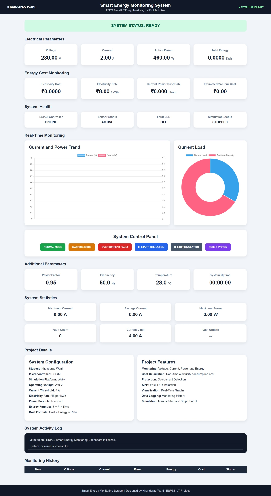
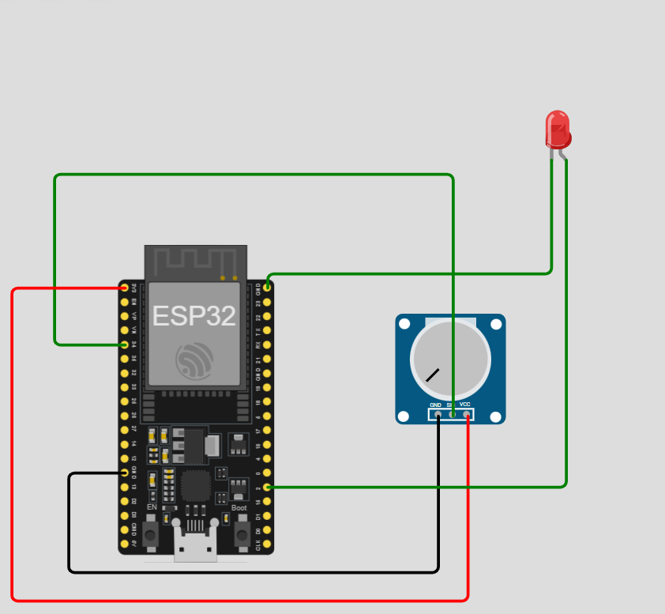

# Smart Energy Monitoring System

> An IoT-based Smart Energy Monitoring and Power Consumption Cost Analysis System using ESP32, Wokwi, C Programming, HTML, CSS, and JavaScript.

## Project Overview

The **Smart Energy Monitoring System** is a final-year engineering project designed to monitor and analyze electrical parameters such as **voltage, current, power, energy consumption, and electricity cost**.

The project combines an **ESP32-based embedded system simulation using Wokwi** with an interactive **web-based monitoring dashboard**.

The system simulates electrical monitoring, calculates power consumption, tracks energy usage, estimates electricity cost, and detects overcurrent conditions.

---

##  Features

-  Voltage monitoring
-  Current monitoring
-  Real-time power calculation
-  Energy consumption tracking
-  Electricity cost estimation
-  Overcurrent fault detection
-  LED-based fault indication
-  System status monitoring
-  System uptime tracking
-  Start Simulation control
-  Stop Simulation control
-  Live graphs and charts
-  Interactive web dashboard
-  Power consumption analysis

---

## Power Calculation

Electrical power is calculated using:

```text
P = V × I
```

Where:

```text
P = Power in Watts
V = Voltage in Volts
I = Current in Amperes
```

### Example

```text
Voltage = 230 V
Current = 2 A

Power = 230 × 2
Power = 460 W
```

---

##  Energy Consumption Calculation

Energy consumption is calculated based on the power used over time.

```text
Energy = Power × Time
```

For electricity consumption:

```text
Energy (kWh) = Power (kW) × Time (hours)
```

---

## Electricity Cost Calculation

The electricity cost is estimated using:

```text
Electricity Cost = Energy Consumed × Electricity Rate
```

This allows the system to estimate the approximate cost of electrical energy consumed over time.

---

## Overcurrent Detection

The system monitors the current value continuously.

```text
Current ≤ Current Limit
        ↓
      NORMAL

Current > Current Limit
        ↓
OVERCURRENT FAULT
```

The configured overcurrent limit in the project is:

```text
4 A
```

When the current exceeds the safety limit:

- The system status changes to a fault condition.
- An LED can provide a visual indication.
- The dashboard can display the abnormal system status.

---

#  Web Dashboard

The Smart Energy Monitoring Dashboard provides a user-friendly interface for monitoring system parameters.

The dashboard displays:

- System Status
- Voltage
- Current
- Power
- Energy Consumption
- Electricity Cost
- Simulation Status
- System Uptime
- Live Data Charts

The dashboard includes simulation controls:

```text
▶ START SIMULATION
⏹ STOP SIMULATION
```

When **START SIMULATION** is selected, the dashboard begins updating simulated electrical values.

When **STOP SIMULATION** is selected:

- Live simulation updates stop.
- The uptime timer stops.
- The dashboard becomes idle except for normal browser activity.

---

# 🔧 Technologies Used

| Technology | Purpose |
|---|---|
| ESP32 | Microcontroller platform |
| Wokwi | Online ESP32 circuit simulation |
| C | Embedded system programming |
| HTML | Web dashboard structure |
| CSS | Dashboard styling |
| JavaScript | Dynamic simulation and calculations |
| GitHub | Version control and project hosting |

---

# Hardware / Simulation Components

The project simulation includes:

- ESP32 Development Board
- Potentiometer / simulated input
- LED
- Connecting wires
- Ground connections

The potentiometer can be used to simulate changing input values.

The ESP32 processes the simulated values and determines the system condition.

---

#  System Architecture

```text
        Electrical Input
              │
              ▼
     ┌─────────────────┐
     │ ESP32 System    │
     └─────────────────┘
              │
              ▼
      Current Monitoring
              │
              ▼
      Power Calculation
           P = V × I
              │
              ▼
    Energy Consumption
              │
              ▼
    Electricity Cost Analysis
              │
              ▼
     Overcurrent Detection
              │
              ▼
      Web Dashboard
```

---

# 📊 System Workflow

```text
START SIMULATION
       │
       ▼
Generate / Read Electrical Values
       │
       ▼
Calculate Voltage and Current
       │
       ▼
Calculate Power
P = V × I
       │
       ▼
Track Energy Consumption
       │
       ▼
Calculate Electricity Cost
       │
       ▼
Check Overcurrent Limit
       │
       ├── Current ≤ 4 A ──► NORMAL
       │
       └── Current > 4 A ──► FAULT
                                  │
                                  ▼
                           LED Indication
```

---

# Project Structure

```text
Smart-Energy-Monitoring-System/
│
├── README.md
│
├── docs/
│   └── Smart_Energy_Project_Report.pdf
│
├── esp32/
│   └── main.c
│
├── website/
│   └── index.html
│
├── Screenshot_5-9-2026_153218_.jpeg
│
└── image.png
```

---

#  Project Screenshots

## Smart Energy Monitoring Dashboard

The dashboard displays electrical parameters, system status, power consumption, energy usage, electricity cost, graphs, simulation controls, and system uptime.



---

## ESP32 Wokwi Circuit

The Wokwi simulation demonstrates the ESP32-based embedded implementation and circuit connections used in the project.



---

# How to Run the Project

## 1. Run the ESP32 Simulation

1. Open the Wokwi project.
2. Open the ESP32 source code.
3. Run the simulation.
4. Observe the generated electrical values.
5. Monitor the system status.
6. Change the potentiometer input to simulate different conditions.
7. Observe the LED indication during an overcurrent condition.

---

## 2. Run the Web Dashboard

1. Open the project folder.
2. Open:

```text
website/index.html
```

3. Run the file in a web browser.
4. Click:

```text
START SIMULATION
```

5. Observe the following values:

- Voltage
- Current
- Power
- Energy Consumption
- Electricity Cost
- System Status
- Graphs
- Uptime

6. Click:

```text
STOP SIMULATION
```

to stop the simulation updates and uptime timer.

---

# Example System Parameters

| Parameter | Description |
|---|---|
| Voltage | Electrical supply voltage |
| Current | Current consumed by the load |
| Power | Calculated using V × I |
| Energy | Power consumed over time |
| Electricity Cost | Energy × Electricity Rate |
| Current Limit | 4 A |
| Fault Detection | Overcurrent Monitoring |
| Status | NORMAL / FAULT |

---

#  Applications

This system can be extended for applications such as:

-  Smart Home Energy Monitoring
-  Building Energy Management
- Industrial Power Monitoring
-  Electrical Load Monitoring
-  Energy Consumption Analysis
-  IoT-Based Monitoring Systems
-  Electricity Cost Analysis

---

# Future Improvements

Possible future improvements include:

- Real ESP32 hardware implementation
- Current sensor integration
- Voltage sensor integration
- Wi-Fi-based IoT communication
- Cloud data storage
- Historical energy consumption analysis
- Mobile application integration
- Multiple device monitoring
- Email or mobile fault notifications
- Automatic load control
- Advanced energy analytics
- Machine learning-based energy consumption prediction

---

# 📄 Project Documentation

The complete project report and documentation are available in the `docs` folder.

```text
docs/
└── Smart_Energy_Project_Report.pdf
```

---

#  Author

## Khanderao Wani

**Electronics Engineering | VLSI Design & Verification | IoT**

---

# Project Summary

The **Smart Energy Monitoring System** demonstrates the integration of:

- Embedded Systems
- ESP32 Programming
- IoT Concepts
- Wokwi Circuit Simulation
- Electrical Parameter Monitoring
- Power and Energy Calculations
- Electricity Cost Analysis
- Overcurrent Fault Detection
- Web-Based Data Visualization

This project provides a foundation that can be further developed into a real-time IoT-based energy monitoring solution.

---

## Smart Energy Monitoring System

### Monitor • Analyze • Optimize

⭐ If you find this project useful or interesting, consider giving the repository a star.
